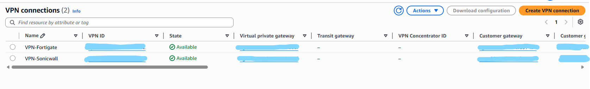
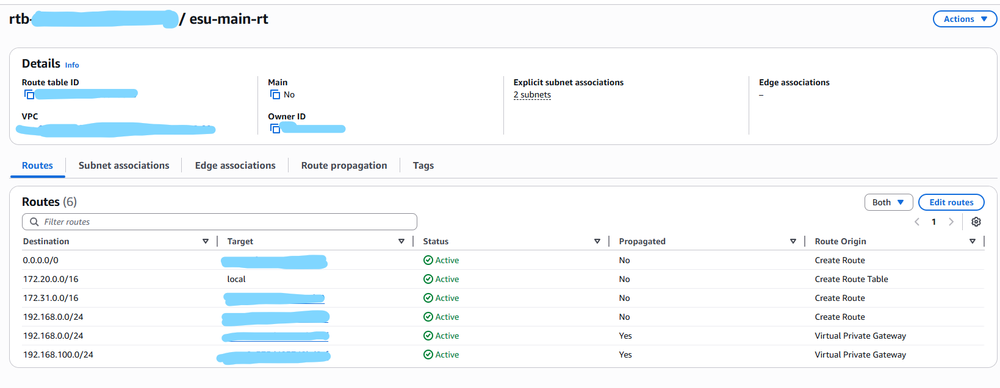
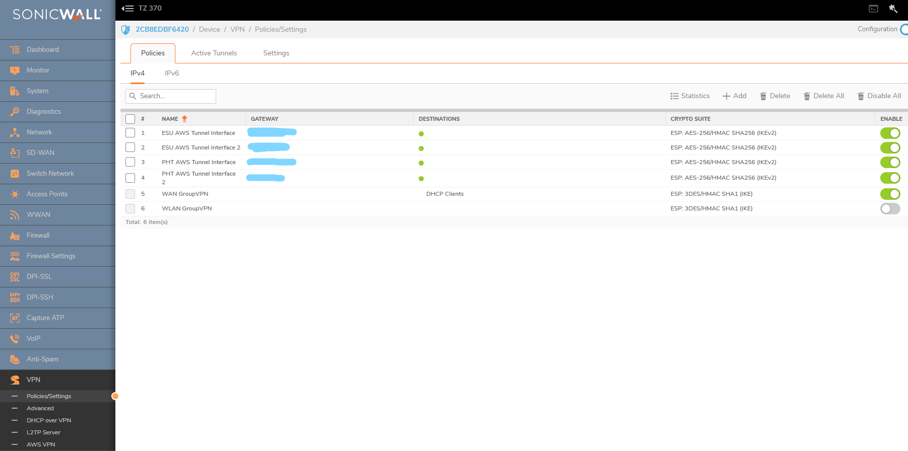
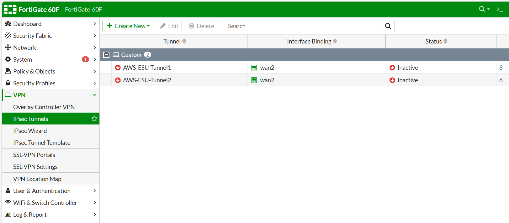
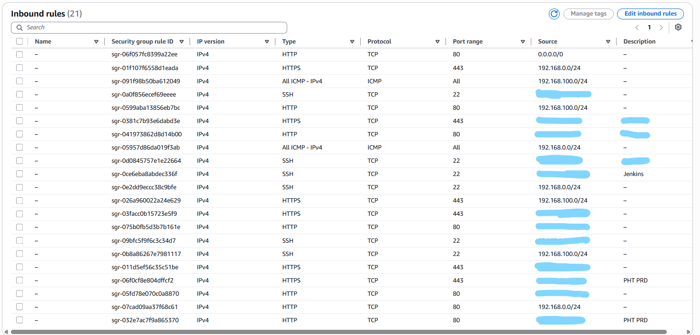

# Multi-Site Hybrid Cloud Network with Multi-Vendor Firewall Integration

> Built and operated AWS hybrid-cloud infrastructure for **two separate companies (ESU and PHT) sharing a single physical office**, integrating each company's on-premises Windows environment with its own AWS account through **dual IPsec Site-to-Site VPN tunnels** terminated on **two different firewall vendors (SonicWall + FortiGate)** for vendor-diverse failover. Provides the AWS foundation that hosts the Odoo ERP described in the Cloudflare Zero Trust project.

**Duration:** April 2025 – July 2025
**Role:** Cybersecurity Specialist (Sole Architect & Implementer)

---

## 📌 Overview

### Background

Two distinct companies — **ESU** and **PHT** — operate from the same physical building (1st floor and 2nd floor respectively). Each company runs its own QuickBooks-based Windows file server on-premises and needed:

- A **dedicated, isolated AWS environment** for hosting application workloads (Dev + Prod), without any cross-tenant data path between the two companies.
- **Secure connectivity from the on-premises QuickBooks file server** to its AWS environment to transfer and submit financial data.
- **Vendor-diverse firewall redundancy** so a single appliance failure or vendor-specific zero-day cannot sever the link to AWS.
- A platform on which the **internal Odoo ERP** (see [Cloudflare Zero Trust project](#)) could be hosted and reached from outside the corporate network.

### Goal

Stand up a **multi-tenant hybrid network** in which each company has:
- Its own AWS account (account-level isolation — strongest blast-radius boundary AWS provides).
- Its own VPC, EC2 (Ubuntu), and RDS (PostgreSQL).
- A redundant IPsec path to AWS terminating on **two physically separate firewalls of two different vendors**.

---

## 🏗️ Architecture

### High-Level Network Topology


| Layer | Component | Notes |
|---|---|---|
| **Building** | Single shared HQ | ESU on 2F, PHT on 1F |
| **2F (ESU)** | FortiGate 60F | Terminates ESU↔AWS IPsec (Tunnel 1 + Tunnel 2) |
| **1F (Shared)** | SonicWall TZ370 | Terminates **both** ESU and PHT IPsec tunnels (4 tunnels total on this device) |
| **On-Prem Servers** | Windows Server (QuickBooks) × 2 | One per company, file-server role |
| **AWS — ESU Account** | VPC `esu-main-vpc` (172.20.0.0/16) | EC2 Ubuntu (t3.medium) + RDS PostgreSQL (Dev + Prod) |
| **AWS — PHT Account** | Separate VPC, separate account | Same pattern: EC2 + RDS |
| **Region / AZ** | `us-east-1` (N. Virginia), AZ `use1-az2` | Single region for both accounts |

### IPsec Tunnel Detail (per company)


For **each** AWS account, the Site-to-Site VPN follows AWS's recommended dual-tunnel model **and** extends it with a multi-vendor twist:

```
                                 ┌──────────────────────┐
                                 │   AWS VPC (per co.)  │
                                 │   ┌──────────────┐   │
                                 │   │     VGW      │   │
                                 │   └──────┬───────┘   │
                                 └──────────┼───────────┘
                                            │
                            ┌───────────────┴────────────────┐
                            │                                │
                  ┌─────────▼─────────┐         ┌────────────▼────────┐
                  │ Customer Gateway  │         │  Customer Gateway   │
                  │   (FortiGate)     │         │     (SonicWall)     │
                  │ 2 IPsec Tunnels   │         │   2 IPsec Tunnels   │
                  └───────────────────┘         └─────────────────────┘
                          ▲                                ▲
                          │ IKEv2 + AES-256                │ IKEv2 + AES-256
                          │ HMAC-SHA-256                   │ HMAC-SHA-256
                          │                                │
                  ┌───────┴────────┐               ┌───────┴─────────┐
                  │  FortiGate 60F │               │  SonicWall TZ370│
                  │   (2F — ESU)   │               │   (1F — Shared) │
                  └────────────────┘               └─────────────────┘
```

A single AWS Virtual Private Gateway is shared by **two Customer Gateways**, each hosted on a different vendor's firewall. Each Customer Gateway runs the AWS-standard pair of IPsec tunnels. The result is **four IPsec tunnels** providing path-, vendor-, and floor-level redundancy for every AWS↔on-prem packet.

---

## 🛠️ Tech Stack

### AWS
- **AWS Account Structure** — One account per company (ESU, PHT) for hard tenant isolation
- **VPC** — `esu-main-vpc` (172.20.0.0/16) and equivalent for PHT
- **EC2** — Ubuntu, instance type `t3.medium` for app workloads
- **RDS** — PostgreSQL (Dev: `db.t3.micro`, Prod: `db.t3.medium`)
- **VPC Peering** — Main VPC peered with default VPC (`172.31.0.0/16`) for shared utility access
- **Site-to-Site VPN** — Virtual Private Gateway (VGW) with two Customer Gateways
- **AWS IAM Identity Center** — Centralized access management (federated via Okta — see [Cloudflare Zero Trust & Okta SSO project](#))

### On-Premises
- **SonicWall TZ370** (1F, shared by ESU + PHT — terminates 4 IPsec tunnels)
- **FortiGate 60F** (2F, ESU only — terminates 2 IPsec tunnels)
- **Windows Server** × 2 — QuickBooks file servers, one per company

### IPsec Parameters
| Parameter | Value |
|---|---|
| **Key Exchange** | IKEv2 |
| **Encryption** | AES-256 |
| **Integrity / HMAC** | SHA-256 |
| **Encapsulation** | ESP |
| **Tunnels per CGW** | 2 (AWS standard) |
| **Failover** | Route propagation enabled on VPC route tables |

---

## ⚙️ Implementation Details

### Step 1 — AWS Account & VPC Foundation (per company)

For each company (ESU and PHT) independently:

- Created a separate AWS account.
- Provisioned a VPC (e.g. ESU: `172.20.0.0/16`) with both public and private subnets.
- Set up an Internet Gateway for outbound EC2 traffic.
- Configured a VPC Peering connection to the default VPC (`172.31.0.0/16`) so utility resources in the default VPC remained reachable.

### Step 2 — Site-to-Site VPN (per company)



- Provisioned a **Virtual Private Gateway** and attached it to the company VPC.
- Created **two Customer Gateways** per VPC — one representing the FortiGate, one representing the SonicWall.
- Created **two VPN Connections** (one per CGW), each automatically provisioned by AWS with two IPsec tunnels for redundancy.
- Enabled **route propagation** on the VPC route table so that on-prem-bound traffic (`192.168.0.0/24`) is reachable via the VGW.

### Step 3 — Route Table Configuration



The ESU main route table illustrates the resulting routing:

| Destination | Target | Origin | Purpose |
|---|---|---|---|
| `0.0.0.0/0` | IGW | Manual | EC2 internet egress |
| `172.20.0.0/16` | local | Auto | Intra-VPC traffic |
| `172.31.0.0/16` | VPC Peering (`pcx-…`) | Manual | Reach default VPC |
| `192.168.0.0/24` | VGW | Manual | On-prem fallback route |
| `192.168.0.0/24` | VGW (**Propagated**) | Auto | Dynamic route from VPN |

### Step 4 — Firewall Configuration

#### SonicWall TZ370 (1F)
The SonicWall serves as the **shared** edge for both companies, terminating four IPsec tunnels (2 per company).



| Tunnel | Crypto Suite |
|---|---|
| ESU AWS Tunnel Interface 1/2 | ESP, AES-256, HMAC-SHA-256, IKEv2 |
| PHT AWS Tunnel Interface 1/2 | ESP, AES-256, HMAC-SHA-256, IKEv2 |

#### FortiGate 60F (2F — ESU only)
A second redundancy path for ESU only, providing vendor diversity for the more critical of the two environments.



| Tunnel | Status |
|---|---|
| AWS-ESU-Tunnel1 | Standby |
| AWS-ESU-Tunnel2 | Standby |

### Step 5 — EC2 + RDS Deployment


- Deployed Ubuntu EC2 instances (`t3.medium`) in the private subnet.
- Provisioned RDS PostgreSQL — separate `dev-postgres` and `prd-rds-restore` instances (the latter restored from a snapshot to validate backup/restore procedures).
- The Odoo ERP described in the Cloudflare Zero Trust project runs on these EC2 hosts.

### Step 6 — Security Group Hardening



Inbound rules were tightened to specific source CIDRs:
- **ICMP** — On-prem CIDRs only (`192.168.0.0/24`, `192.168.100.0/24`).
- **SSH (22)** — Restricted to specific admin egress IPs (home offices, CI/CD bastion).
- **HTTPS (443)** — Restricted to known business partner / admin IPs.
- **HTTP (80)** — Open to `0.0.0.0/0`. **See Design Decision below for why this is intentional and not a misconfiguration.**

### Step 7 — Identity & Access
- AWS console access for both accounts is governed by **AWS IAM Identity Center**, federated through Okta.
- No long-lived IAM users; engineer access is via short-lived role assumption.
- See [Cloudflare Zero Trust & Okta SSO project](#) for the upstream Okta configuration.

---

## 📐 Design Decisions

### Why Two Firewall Vendors Instead of One Pair of the Same?

A redundant pair of identical firewalls protects against **hardware failure** but not against **vendor-specific bugs or zero-day vulnerabilities**. If a critical CVE drops for FortiGate at 3 AM, two FortiGates are no safer than one. Pairing FortiGate with SonicWall means:

- A vendor-specific exploit takes out **at most one** of the two paths.
- A buggy firmware update on one vendor leaves the other untouched.
- The on-call engineer can fail traffic over to the other vendor while the affected one is patched, without an outage window.

The trade-off is **two configuration languages** to maintain instead of one. For a two-firewall edge in a small company environment, this is a manageable cost.

### Why Separate AWS Accounts Per Company?

ESU and PHT share a building, an engineer (me), and some IT processes — but they are **legally and operationally distinct companies**. Putting their workloads in separate AWS accounts (rather than separate VPCs in one account) provides:

- **IAM isolation by default** — no risk that a permissive role in one company's app accidentally reaches the other's data.
- **Billing isolation** — each company is invoiced for its own consumption with zero allocation work.
- **Independent compromise blast radius** — an account-level credential leak in one company does not give the attacker any path into the other.

### Why HTTP 80 Open to `0.0.0.0/0`

This is the most counter-intuitive rule in the security group. It is **deliberate** and works in concert with the Cloudflare Zero Trust deployment described in the [Cloudflare Zero Trust project](#).

- Inbound traffic to Odoo does **not** arrive over the public internet on port 80.
- The Odoo EC2 runs the **`cloudflared` daemon**, which holds an **outbound-only** tunnel to Cloudflare's edge.
- Cloudflare delivers user traffic *inside that tunnel*, where it appears to the EC2's network stack as **localhost-originated** (or originating from the cloudflared loopback path).
- The `0.0.0.0/0` rule on port 80 therefore does **not** expose Odoo to the internet — there is no public route from the internet to the EC2's port 80 in the first place, because the EC2 has no public-facing port 80 listener for direct traffic.
- The rule is a permissive fallback; the actual access boundary is enforced by **Cloudflare Access policy + the absence of an inbound public path**.

In a future iteration this rule should still be tightened to Cloudflare's published IP ranges as a defense-in-depth measure (see Future Improvements).

---

## 📈 Outcome

- **Two independent AWS environments** for ESU and PHT, each running Dev + Prod workloads (Ubuntu EC2 + PostgreSQL RDS) on `us-east-1`.
- **Four IPsec tunnels per company** (where applicable), with **vendor-diverse failover** between SonicWall and FortiGate.
- **QuickBooks data transfer** from on-prem Windows file servers to AWS runs entirely over the IPsec mesh — no QuickBooks data ever traverses the public internet.
- **Foundational platform** for the Odoo ERP rollout: this AWS infrastructure is the host that the Cloudflare Zero Trust project then exposes safely to remote employees.
- **Account-level tenant isolation** between the two companies — neither company has any IAM, network, or data path into the other.
- **Verified backup/restore** for RDS through a `prd-rds-restore` instance derived from a production snapshot.

---

## 🔐 Security Considerations

| Concern | Mitigation |
|---|---|
| Cross-tenant data leakage between ESU and PHT | **Separate AWS accounts** — strongest isolation boundary AWS offers |
| Single firewall vendor zero-day | **Multi-vendor edge** — FortiGate and SonicWall on independent paths |
| Single firewall hardware failure | Each vendor terminates **two IPsec tunnels** (AWS-standard pair) → 4 tunnels per company in total |
| QuickBooks data exposure on the public internet | All transfers traverse **IKEv2 + AES-256 + HMAC-SHA-256** IPsec tunnels |
| Cleartext data in transit at rest | RDS at-rest encryption + TLS to RDS endpoint |
| Long-lived IAM credentials | **AWS IAM Identity Center**, federated via Okta — short-lived role-assumed sessions |
| Public exposure of Odoo origin (despite SG `0.0.0.0/0`) | Origin port has **no public listener**; access is mediated through Cloudflare Tunnel (see Design Decisions) |
| Lateral movement from a breached EC2 | Private subnets for compute; on-prem traffic only via VGW; no flat networking |
| Unaudited inbound traffic | Specific source CIDRs on SG for SSH (22) and HTTPS (443); ICMP scoped to on-prem CIDRs |

---

## 🚀 Future Improvements

- **Migrate VPN to Transit Gateway** to simplify scaling once a third site or third company is added.
- **BGP-only routing** if any tunnels are still using static fallback routes; AWS recommends BGP for sub-second failover.
- **Tighten SG rule for HTTP 80** to Cloudflare's published IP ranges as defense-in-depth, even though there is currently no inbound public path.
- **VPC Flow Logs** to S3 + Athena for retroactive traffic analysis and incident forensics.
- **AWS Network Firewall** for L7 inspection on egress traffic from EC2.
- **Cross-account observability** — centralized CloudWatch / SIEM ingestion (likely via Microsoft Sentinel — see [External Login Detection project](#)).
- **Infrastructure-as-Code** — migrate the current click-built configuration to Terraform for reproducibility and disaster recovery.

---

## 🔗 Related Projects in this Portfolio

This project is the **foundation layer** of a broader security architecture. Its outputs feed into:

- **Cloudflare Zero Trust & Okta SSO** — uses this AWS infrastructure as the host for the Odoo ERP and its `cloudflared` tunnel endpoint.
- **External Login Detection (Sentinel + Logic Apps)** — could ingest CloudWatch logs from this infrastructure as a future enhancement.
- **Auto Logout Automation** — governs the Microsoft sessions that authenticate users into Odoo on these EC2 hosts.

Together, these four projects form a layered defense: the network layer (this project), the access layer (Cloudflare + Okta), the identity layer (Auto Logout), and the detection layer (Sentinel).

---

## 📁 Repository Structure

```
.
├── README.md
├── diagrams/
│   ├── network-topology.png
│   ├── network-topology.drawio
│   ├── ipsec-tunnel-detail.png
│   └── ipsec-tunnel-detail.drawio
└── screenshots/
    ├── aws-vpn-connections.png
    ├── aws-route-table.png
    ├── rds-databases.png
    ├── sg-inbound-rules.png
    ├── sonicwall-tunnels.png
    └── fortigate-tunnels.png
```

---

## ⚠️ Disclaimer

This documentation describes the architecture, design decisions, and workflow only. All AWS account IDs, resource IDs (VPC, VGW, CGW, route table, peering, gateway), public IP addresses, and company-identifying tags have been redacted or replaced with placeholders. Screenshots are sanitized copies; no credentials, tunnel pre-shared keys, certificates, or internal hostnames are included.

---

## 👤 Author

**Changjae Chung** — Cybersecurity Specialist
🔗 [LinkedIn](https://www.linkedin.com/in/changjae-chung-374821176)
